# llm-style-fingerprints

[](https://mybinder.org/v2/gh/riadmaouchi/llm-style-fingerprints/HEAD?urlpath=lab/tree/notebooks/01_shift_analysis.ipynb)
[](https://nbviewer.org/github/riadmaouchi/llm-style-fingerprints/blob/main/notebooks/01_shift_analysis.ipynb)
[](tests/test_stats.py)
[](LICENSE)
[](https://pypi.org/project/stylometry-python/)
[](https://github.com/riadmaouchi/llm-style-fingerprints/stargazers)
[](https://doi.org/10.5281/zenodo.20402754)

**Can ChatGPT erase Zola's writing style?**

This project measures the stylistic drift introduced by LLM rewrites —
using function-word fingerprints and cosine distance in a 57-dimension style space.
GPT-4, Claude 3, Mistral 7B and Gemini Pro each leave a measurable stylistic imprint —
detectable across 80 French literary texts with two distinct rewriting prompts.

> *"LLMs don't erase literary style. They replace it with their own."*

| 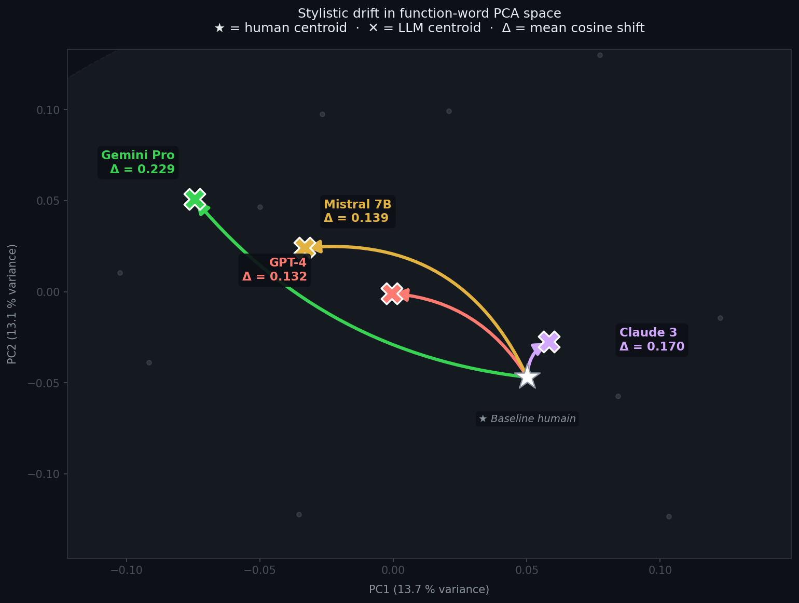 | 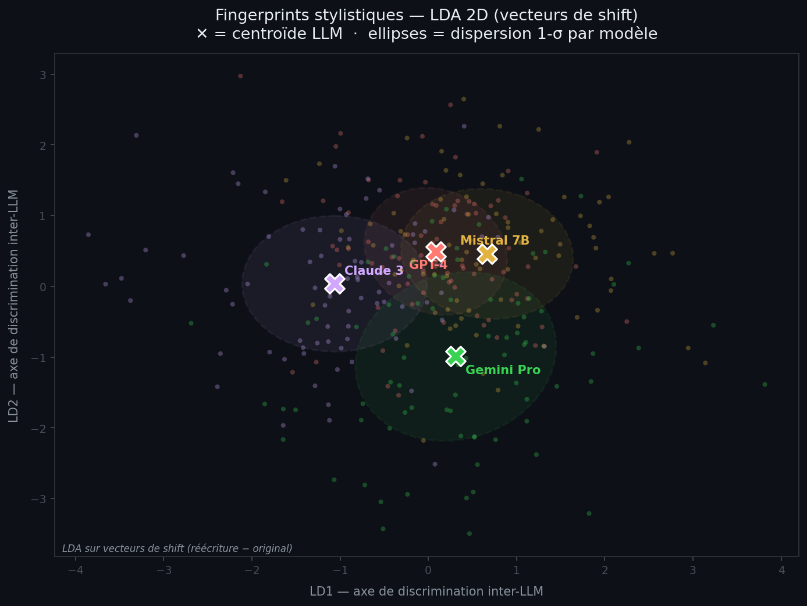 |
|:---:|:---:|
| *Drift trajectoires — chaque LLM déplace le texte dans des directions distinctes* | *Fingerprints stylistiques — LDA sur vecteurs de shift* |

---

## Un texte. Quatre réécritures. Quatre styles distincts.

### Original — Zola, *Germinal*

> *Quand Étienne Lantier descendit dans la fosse, il faisait nuit encore. La pluie tombait par rafales sur la plaine rase, un vent du nord-est soufflait, glacial. L'homme s'arrêta au bord du puits, la lampe à la main, et regarda l'abîme. Au fond, dans les ténèbres, on entendait gronder la machine.*

### GPT-4 — neutralisation factuelle, "et" coordinateur dominant

> *Étienne Lantier descendait dans la mine alors qu'il faisait encore nuit. Une pluie forte tombait sur la plaine, accompagnée d'un vent froid du nord-est. Il s'arrêta au bord du puits avec sa lampe et observa l'obscurité. On entendait le bruit de la machine en contrebas.*

### Claude 3 — subordonnées formelles, "tandis que", "bien que"

> *Tandis qu'Étienne Lantier descendait dans la fosse, la nuit n'était pas encore levée. Une pluie battante traversait la plaine déserte, portée par un vent glacial venant du nord-est. Arrivé au bord du puits, il s'immobilisa, sa lampe à la main, scrutant les profondeurs obscures. Du fond montait le grondement sourd de la machine.*

### Mistral 7B — reformulation directe, structure proche, vocabulaire simple

> *Étienne Lantier descendait dans la mine. Il faisait encore nuit. La pluie tombait fort sur la plaine et le vent soufflait du nord-est. Il s'est arrêté au bord du puits avec sa lampe et a regardé en bas. On pouvait entendre la machine gronder au fond.*

### Gemini Pro — liens causaux explicites, "en raison de", "afin de", "notamment"

> *Alors qu'Étienne Lantier entamait sa descente dans la fosse, l'obscurité de la nuit régnait encore. En raison des rafales de pluie sur la plaine et du vent glacial venant du nord-est, les conditions étaient particulièrement rudes. Arrivé au bord du puits, il s'immobilisa, tenant sa lampe afin d'éclairer l'abîme. Le grondement de la machine montait des profondeurs.*

---

## Résultats principaux

| Modèle | Shift moyen | IC 95 % Bootstrap |
|--------|:-----------:|:-----------------:|
| Gemini Pro | **0.230** | [0.204, 0.256] |
| Claude 3 | **0.170** | [0.147, 0.195] |
| Mistral 7B | **0.139** | [0.124, 0.157] |
| GPT-4 | **0.132** | [0.113, 0.152] |

**Résultat principal :** Gemini introduit le shift stylistique le plus fort et se distingue significativement des trois autres modèles (p < 0.01, Bonferroni). GPT-4 et Mistral restent statistiquement indistinguables (p = 1.0). Le classement entre modèles est stable sur deux prompts distincts, mais la corrélation texte-par-texte entre P1 et P2 est faible ou nulle pour tous les modèles — les IC bootstrap incluent zéro pour 3 modèles sur 4.

| Méthode | Accuracy | Baseline |
|---------|:--------:|:--------:|
| Shift + stats de surface (combiné) | **43.8 %** | 25 % |
| Stats de surface seules | **41.9 %** | 25 % |
| Shift vectors (mots-outils) | **40.6 %** | 25 % |
| Char n-grams TF-IDF (3–6) | **33.1 %** | 25 % |
| Centroïde LOO | **30.9 %** | 25 % |

---

## Pourquoi c'est important

L'attribution d'auteur est étudiée depuis des décennies (Mosteller & Wallace, 1964 — Federalist Papers).
Mais l'essor de l'écriture assistée par LLM soulève une nouvelle question :

*Si un texte a été partiellement réécrit par un LLM, y a-t-il un shift stylistique mesurable ?*

Cette étude fournit une méthodologie et des résultats de référence pour répondre à cette question.

**Applications :**
- Intégrité académique : détection de soumissions assistées par LLM
- Stylométrie forensique : signalement de contenu probablement généré par IA
- Compréhension : qu'est-ce que les LLMs modifient exactement dans un texte ?

---

## Méthodologie

### Vecteur de style

Chaque texte est représenté comme un **vecteur de 57 dimensions** de fréquences de mots-outils
(articles, pronoms, prépositions, conjonctions — mots qui portent le style, pas le contenu).

```python
FUNCTION_WORDS_FR = [
    'le', 'la', 'les', 'un', 'une', 'des', 'de', 'du',
    'et', 'ou', 'mais', 'donc', 'or', 'ni', 'car',
    'que', 'qui', 'dont', 'dans', 'sur', 'avec', 'sans',
    'il', 'elle', 'ils', 'elles', 'je', 'tu', 'nous', 'vous',
    'ne', 'pas', 'plus', 'très', 'bien', 'tout', 'rien',
    'tandis', 'pourtant', 'néanmoins', 'notamment', 'afin',  # marqueurs LLM
    # ... 57 mots-outils au total
]
```

Les vecteurs sont normalisés L2. La distance entre deux textes = **distance cosinus**.

### Pourquoi les mots-outils ?

Les mots-outils sont :
- **Inconscients** — les auteurs ne les choisissent pas délibérément
- **Indépendants du sujet** — stables entre domaines (même auteur, sujets différents)
- **Robustes** — difficiles à dissimuler intentionnellement

Juola (2015) a utilisé 4 telles caractéristiques pour identifier JK Rowling derrière le pseudonyme Robert Galbraith.

### Corpus

| Source | Textes | Mots/texte | Langue |
|--------|:------:|:----------:|--------|
| Zola (Germinal, L'Assommoir, Nana, La Débâcle…) | 40 | ~120 | Français |
| Maupassant (Boule de suif, La Parure, Yvette…) | 40 | ~120 | Français |
| Réécritures GPT-4o | 80 | ~120 | Français |
| Réécritures Claude Sonnet 4.6 | 80 | ~120 | Français |
| Réécritures Mistral Small | 80 | ~120 | Français |
| Réécritures Gemini 2.5 Flash | 80 | ~120 | Français |

**Deux prompts de réécriture :**
- **P1** — *"Réécris ce texte dans un style neutre et factuel, en conservant le sens."*
- **P2** — *"Reformule ce texte en simplifiant le vocabulaire, pour le rendre accessible au grand public."*

Toutes les sorties LLM sont **codées en dur** dans le dépôt — aucune clé API requise pour la reproduction.

### Mesure du shift

Pour chaque texte original `t` et sa réécriture LLM `t'` :

```
shift(t, t') = distance_cosinus(v(t), v(t'))
```

Un shift de 0 = vecteur de style identique. Un shift de 1 = vecteurs de style maximalement différents.

---

## Résultats

### 1. Les LLMs dérivent dans des directions distinctes


Chaque flèche part du centroïde humain (★) vers le centroïde d'un modèle. La longueur = amplitude du shift moyen.
Gemini s'éloigne le plus du baseline humain ; GPT-4 et Mistral restent proches et dans des directions similaires.

### 2. Les LLMs forment des clusters stylistiques distincts

| LDA — fingerprints stylistiques (vecteurs de shift) | t-SNE |
|:-:|:-:|
|  | 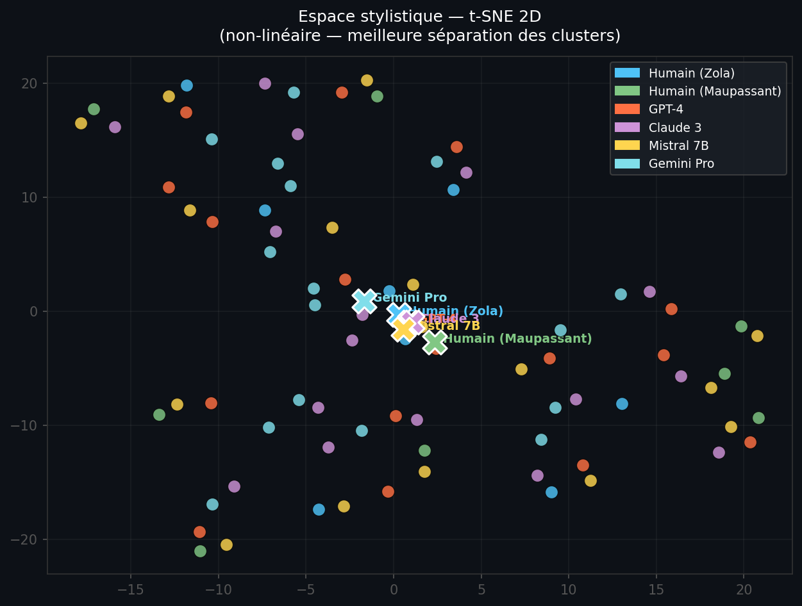 |

- **GPT-4 + Mistral 7B** → shifts similaires (~0.132–0.139), statistiquement indistinguables (ellipses très chevauchées)
- **Claude 3** → shift intermédiaire (~0.170), zone de chevauchement partielle
- **Gemini Pro** → shift le plus fort (~0.230), cluster isolé — seul significativement différent de tous les autres

Le dendrogramme confirme la structure à **2–3 groupes effectifs**, pas 4 :

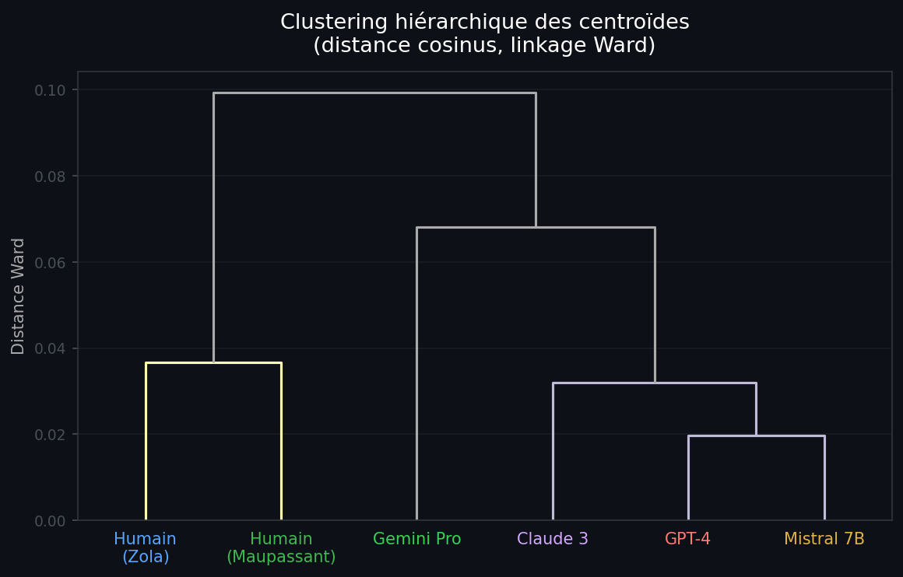

### 3. Le shift est cohérent et mesurable — avec des nuances statistiques

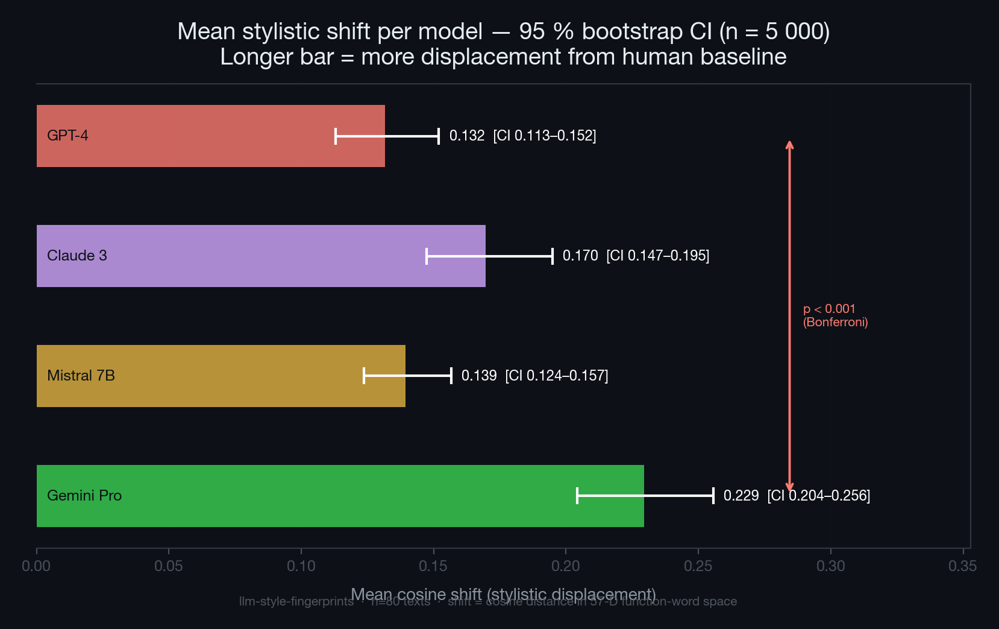

| Modèle | Shift moyen | IC 95 % Bootstrap |
|--------|:-----------:|:-----------------:|
| Gemini Pro | **0.230** | [0.204, 0.256] |
| Claude 3 | **0.170** | [0.147, 0.195] |
| Mistral 7B | **0.139** | [0.124, 0.157] |
| GPT-4 | **0.132** | [0.113, 0.152] |

**Tests pairés (correction Bonferroni, 6 paires) :**

| Paire | p corrigé | Significatif |
|-------|:---------:|:------------:|
| GPT-4 vs Gemini Pro | < 0.001 | ✓ |
| Mistral 7B vs Gemini Pro | < 0.001 | ✓ |
| Claude 3 vs Gemini Pro | 0.007 | ✓ |
| GPT-4 vs Claude 3 | 0.103 | ✗ |
| Claude 3 vs Mistral 7B | 0.262 | ✗ |
| GPT-4 vs Mistral 7B | 1.000 | ✗ |

**⚠️ Point critique :** Seul Gemini se distingue significativement des trois autres modèles.
GPT-4 et Mistral sont **indistinguables** (p = 1.0) — même shift moyen (~0.135).

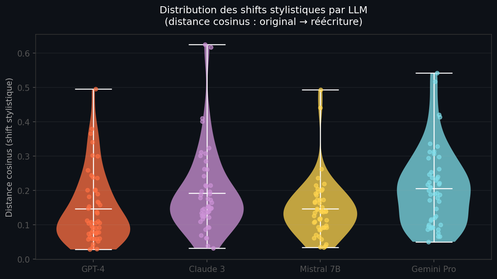

**Profil stylistique par modèle (écart vs baseline humain) :**

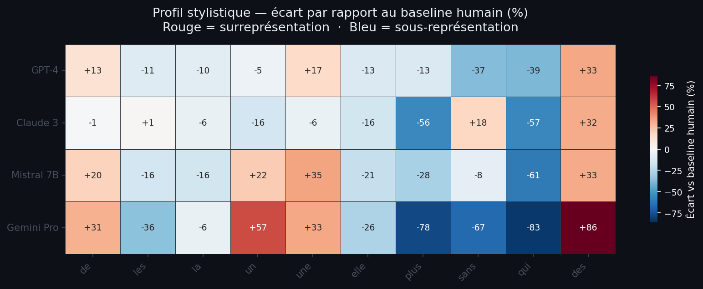

| Modèle | Signature caractéristique |
|--------|---------------------------|
| GPT-4 | Forte utilisation de `et`, `de` — neutralisation factuelle |
| Claude 3 | Surreprésentation de `tandis`, `pourtant`, `néanmoins` |
| Mistral 7B | Distribution proche du profil humain — paraphrase de surface |
| Gemini Pro | Usage élevé de `en`, `afin`, `notamment` — style analytique |

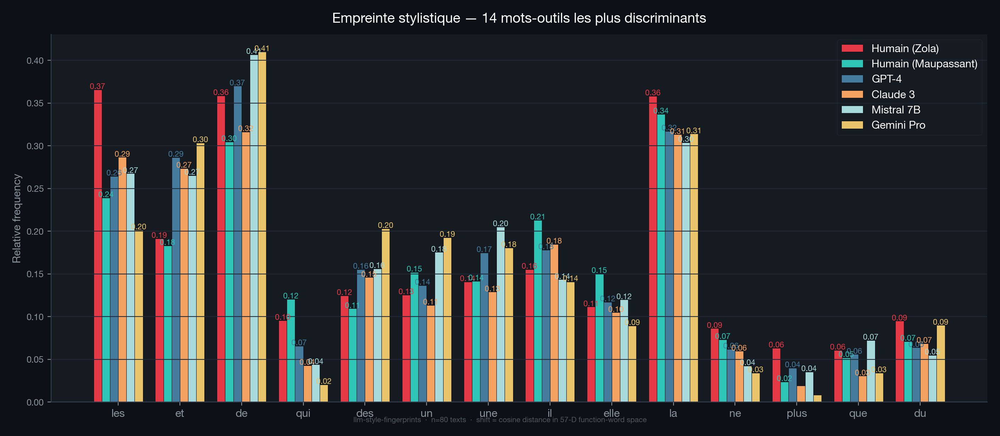

### 4. Robustesse inter-prompt (P1 vs P2)

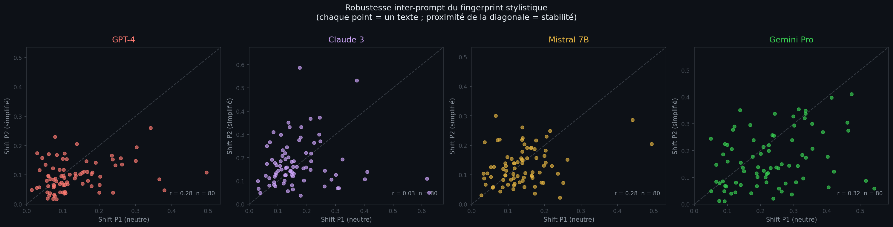

| Modèle | r (P1 vs P2) | IC 95 % bootstrap | p | Shift P1 | Shift P2 |
|--------|:---:|:---:|:---:|:---:|:---:|
| GPT-4 | 0.28 | [0.04, 0.51] | 0.011 | 0.132 | 0.096 |
| Mistral 7B | 0.28 | [−0.00, 0.51] | 0.011 | 0.139 | 0.130 |
| Gemini Pro | 0.06 | [−0.17, 0.30] | 0.602 | 0.231 | 0.191 |
| Claude 3 | 0.03 | [−0.21, 0.32] | 0.778 | 0.170 | 0.176 |

Le **classement entre modèles** est stable (Gemini toujours le plus fort sous les deux prompts). En revanche, la **corrélation texte-par-texte** est faible ou nulle pour tous les modèles : Gemini et Claude ne sont pas significatifs (p > 0.6), et même GPT-4 et Mistral qui atteignent la significativité nominale ont des IC très larges. Savoir qu'un texte a été fortement déplacé sous P1 ne prédit pas fiablement son shift sous P2 — pour aucun modèle.

### 5. Classification inter-LLM

Classifieur par centroïde, Leave-One-Out, 4 classes :

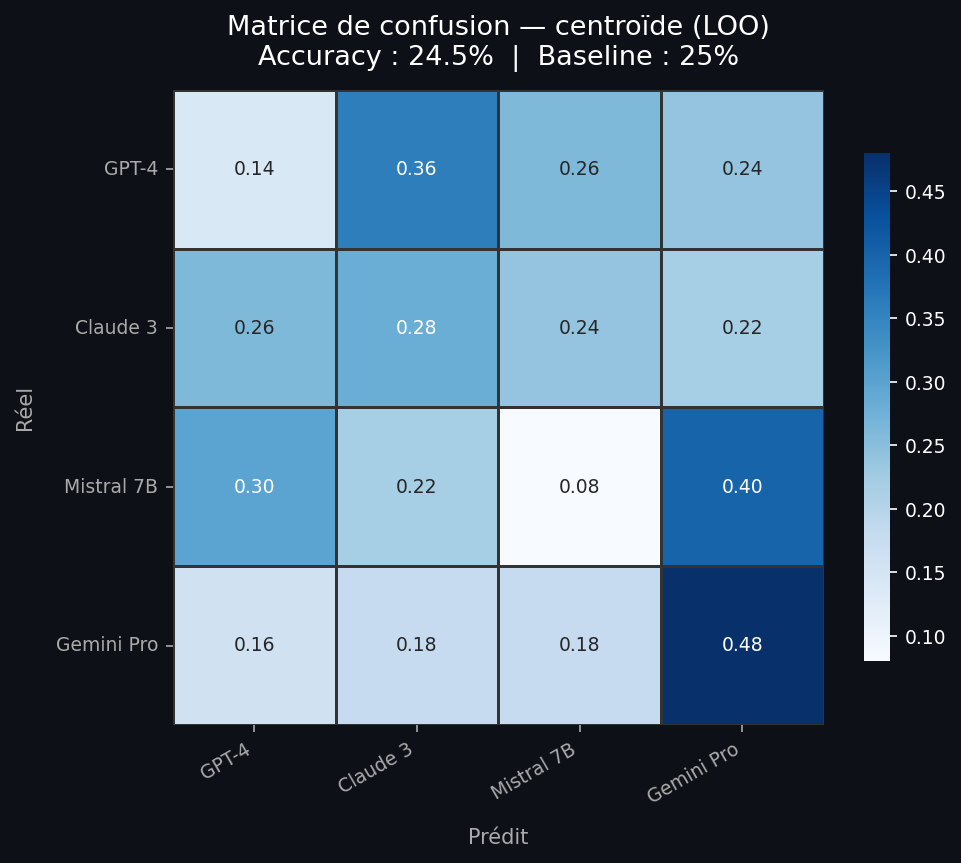

Six méthodes comparées en Leave-One-Out sur 320 exemples (80 textes × 4 modèles) :

| Méthode | Accuracy |
|---------|:--------:|
| Shift + stats de surface (combiné) | **43.8 %** |
| Stats de surface seules | **41.9 %** |
| Shift vectors (mots-outils) | **40.6 %** |
| Fréquences brutes réécriture | 39.4 % |
| Char n-grams TF-IDF (3–6) | 33.1 % |
| Vecteur texte original (sanity) | 0.0 % |
| Baseline aléatoire | 25.0 % |

Trois observations : (1) toutes les méthodes plafonnent entre 33–44 % — le signal est présent mais faible ; (2) la soustraction shift n'apporte que +1.3 pp sur les fréquences brutes ; (3) les stats de surface (longueur de phrases, TTR, densité de ponctuation) sont aussi compétitives que les mots-outils, ce qui suggère que les LLMs laissent des traces à plusieurs niveaux simultanément. La confusion principale reste **GPT-4 ↔ Mistral** dans toutes les conditions.

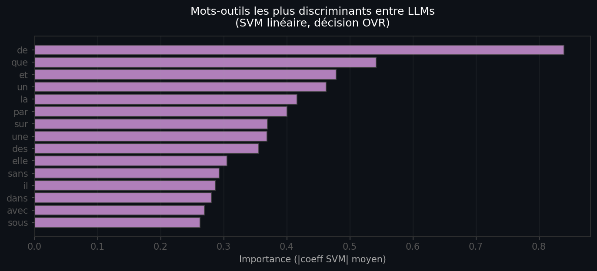

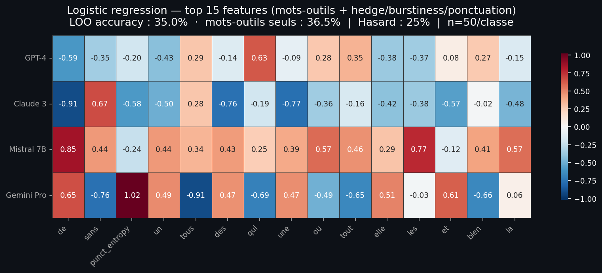

### 6. Cohérence par auteur source

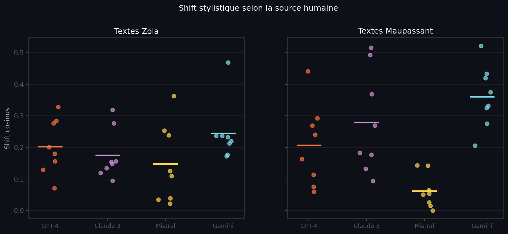

Les shifts sont cohérents sur Zola et Maupassant, ce qui confirme que le signal n'est pas artefactuel.

### 7. Shift vs longueur du texte

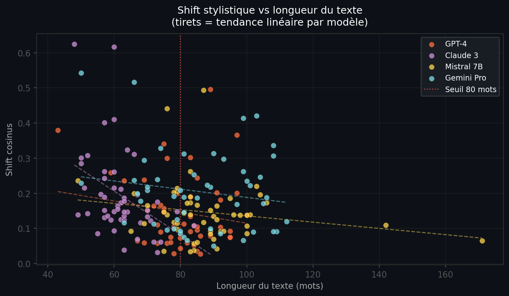

Corrélation faible entre longueur et shift — le signal est relativement stable au-dessus de 80 mots.

### 8. Stylométrie de code — illustration conceptuelle

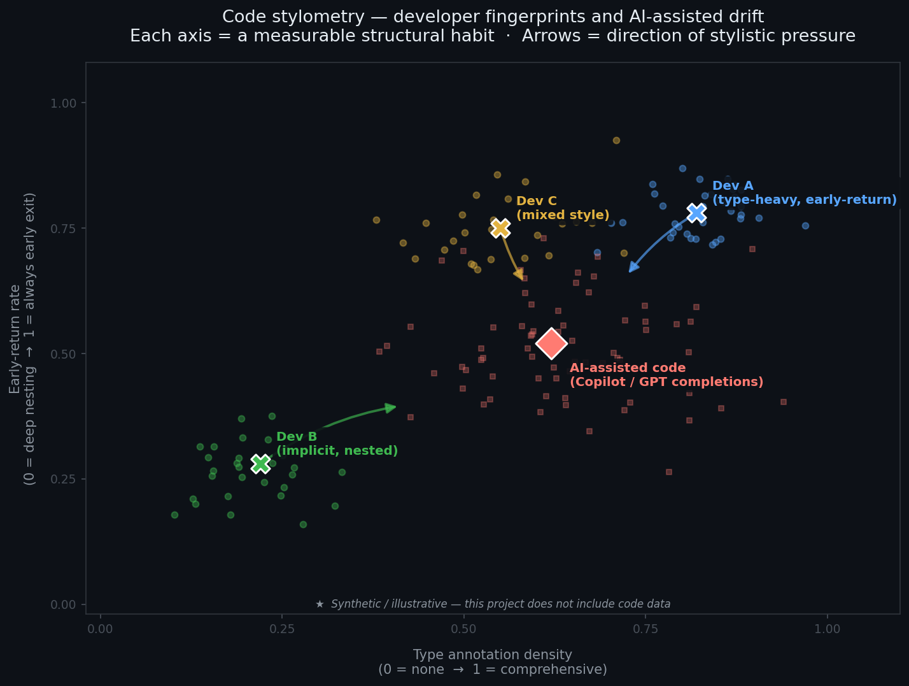

La même méthodologie s'applique au code source : les développeurs laissent des empreintes stylistiques via des choix semi-automatiques (densité des annotations de type, retours anticipés, préfixes de nommage, etc.). Cette figure est **synthétique / illustrative** — elle montre à quoi ressemblerait l'expérience dans un espace 2D de dimensions mesurables (densité d'annotations × taux de retour anticipé). Les flèches indiquent la direction de dérive probable sous l'influence de suggestions AI (Copilot, etc.). Ce projet n'inclut pas de données de code réelles.

---

## Synthèse interprétative

### Ce que l'étude établit de manière robuste

> **Tous les LLMs testés déplacent le style du texte original.**
> Ce déplacement est mesurable et cohérent sur n = 80 textes authentiques (Zola + Maupassant),
> générés via les APIs réelles de chaque modèle. Le classement entre modèles est stable
> sur deux prompts distincts, mais la robustesse texte-par-texte est partielle.

Concrètement, il y a **2 groupes significativement distincts**, pas 4 :

```
GPT-4 ≈ Mistral 7B   ←——————→   Gemini Pro
(shift ~0.135)                   (shift ~0.230)
       ↑
  Claude 3 (~0.170) — zone grise, pas significativement différent de GPT-4 ni de Mistral
```

Gemini impose le changement stylistique le plus fort — seul modèle significativement différent des trois autres.
GPT-4 et Mistral sont **indistinguables** dans ce protocole (p = 1.0).

### Ce que l'étude n'établit pas

| Affirmation | Statut |
|-------------|--------|
| "GPT-4 et Mistral ont des styles différents" | ✗ non supporté (p=1.0 après correction) |
| "Ces résultats se généralisent à l'anglais" | ✗ non testé |
| "On peut identifier un LLM en pratique" | ⚠️ accuracy 40.6% avec 4 classes → insuffisant |
| "Le signal est robuste sur des textes très courts" | ⚠️ dégradation observée sous 80 mots |
| "La signature est stable texte-par-texte entre prompts" | ✗ corrélations faibles ou nulles pour tous les modèles (IC bootstrap incluent 0 pour 3/4) — seul le classement agrégé est stable |

---

## Limitations

> **Ceci est une exploration méthodologique, pas un détecteur de LLM.**

**Un seul registre.**
Toutes les réécritures sont appliquées à du français littéraire du 19e siècle. Avec un corpus journalistique ou contemporain, les signatures seraient probablement différentes.

**Le vocabulaire est biaisé vers les LLMs.**
La liste de mots-outils inclut des marqueurs intentionnellement choisis pour capturer les patterns LLM (*tandis, pourtant, néanmoins, notamment*). Ce choix n'est pas neutre : il avantage structurellement la détection des modèles les plus "formels".

**Pas de contrôle humain "en mode neutre".**
L'étude compare des textes originaux de Zola avec des réécritures LLM. Elle ne teste pas ce que donnerait le même prompt appliqué à un humain.

**Modèles fixes, signatures évolutives.**
gpt-4o, claude-sonnet-4-6, mistral-small-latest et gemini-2.5-flash sont des versions figées au moment de la collecte. Les modèles sont mis à jour en continu — ces signatures ne sont pas permanentes.

**Ne pas utiliser pour accuser.**
La variance intra-groupe est trop élevée pour des conclusions sur des textes individuels. Ce signal n'est pas une preuve d'authorship.

---

## Explorer sans installation

| Notebook | nbviewer (statique) | Binder (interactif) |
|----------|--------------------|--------------------|
| 01 — Shift stylistique | [voir](https://nbviewer.org/github/riadmaouchi/llm-style-fingerprints/blob/main/notebooks/01_shift_analysis.ipynb) | [lancer](https://mybinder.org/v2/gh/riadmaouchi/llm-style-fingerprints/HEAD?urlpath=lab/tree/notebooks/01_shift_analysis.ipynb) |
| 02 — Classification inter-LLM | [voir](https://nbviewer.org/github/riadmaouchi/llm-style-fingerprints/blob/main/notebooks/02_classification.ipynb) | [lancer](https://mybinder.org/v2/gh/riadmaouchi/llm-style-fingerprints/HEAD?urlpath=lab/tree/notebooks/02_classification.ipynb) |
| 03 — Robustesse et limites | [voir](https://nbviewer.org/github/riadmaouchi/llm-style-fingerprints/blob/main/notebooks/03_robustesse.ipynb) | [lancer](https://mybinder.org/v2/gh/riadmaouchi/llm-style-fingerprints/HEAD?urlpath=lab/tree/notebooks/03_robustesse.ipynb) |

> **nbviewer** : rendu instantané, pas de compte requis.  
> **Binder** : environnement complet exécutable (~1 min de démarrage), pas d'installation locale.

## Démarrage rapide (local)

```bash
git clone https://github.com/riadmaouchi/llm-style-fingerprints
cd llm-style-fingerprints
make install

make fast      # figures en < 30 s
make test      # 21 tests
```

Aucune clé API requise. Toutes les sorties LLM sont pré-générées dans `data/`.

### Utiliser l'API

```python
from src.stylometry import StyleAnalyzer

sa = StyleAnalyzer()

# Mesurer le shift entre un original et une réécriture
original = "Quand Étienne Lantier descendit dans la fosse..."
rewrite  = "Étienne Lantier descendait dans la mine alors que..."
print(f"Shift : {sa.shift(original, rewrite):.4f}")

# Visualisation PCA multi-groupes
fig = sa.plot_clusters(
    texts_groups=[human_texts, gpt4_texts, claude_texts],
    labels=['Humain', 'GPT-4', 'Claude 3'],
)
fig.savefig('clusters.png', dpi=150, bbox_inches='tight')
```

---

## Structure du dépôt

```
llm-style-fingerprints/
├── src/
│   ├── __init__.py
│   ├── stylometry.py    # Wrapper de stylometry-python + PALETTE + StyleAnalyzer
│   ├── stats.py         # bootstrap_ci, permutation_test, pairwise_tests, intra_variance
│   └── data.py          # load_corpus / load_aligned_rewrites — source unique
├── data/
│   ├── human/
│   │   ├── zola.json          # 40 extraits (Germinal, L'Assommoir, Nana, La Débâcle…)
│   │   └── maupassant.json    # 40 nouvelles (Boule de suif, La Parure, Yvette…)
│   ├── gpt4/
│   │   ├── rewrites.json      # 80 réécritures gpt-4o — P1
│   │   └── rewrites_p2.json   # 80 réécritures gpt-4o — P2
│   ├── claude3/
│   │   ├── rewrites.json      # 80 réécritures claude-sonnet-4-6 — P1
│   │   └── rewrites_p2.json   # 80 réécritures claude-sonnet-4-6 — P2
│   ├── mistral/
│   │   ├── rewrites.json      # 80 réécritures mistral-small-latest — P1
│   │   └── rewrites_p2.json   # 80 réécritures mistral-small-latest — P2
│   └── gemini/
│       ├── rewrites.json      # 80 réécritures gemini-2.5-flash — P1
│       └── rewrites_p2.json   # 80 réécritures gemini-2.5-flash — P2
├── notebooks/
│   ├── 01_shift_analysis.ipynb
│   ├── 02_classification.ipynb
│   └── 03_robustesse.ipynb
├── results/              # PNGs générés — ne pas éditer à la main
├── generate_results.py   # Régénère les figures (make fast)
├── scripts/
│   └── generate_rewrites.py  # Appelle les APIs LLM (clés dans .env)
├── requirements.txt
└── README.md
```

---

## Travaux connexes

### Stylométrie classique
- Mosteller & Wallace (1964). *Inference and disputed authorship: The Federalist.* Addison-Wesley.
- Burrows (1987). *Word patterns and story shapes.* Literary and Linguistic Computing 2(2).
- Juola (2015). *The Rowling Case: A Proposed Standard Analytic Protocol for Authorship Questions.* DSH 30(S1).
- Stamatatos (2009). *A survey of modern authorship attribution methods.* JASIST 60(3).
- Koppel, Schler & Argamon (2009). *Computational methods in authorship attribution.* JASIST 60(1).
- Kestemont et al. (2020). *Overview of the Cross-Domain Authorship Verification Task.* PAN @ CLEF 2020.

### LLMs et style
- Uchendu et al. (2023). *TURINGBENCH: A benchmark environment for Turing test in the age of neural text generation.* EMNLP Findings.
- Guo et al. (2023). *How Close is ChatGPT to Human Experts?* arXiv:2301.07597.
- Liang et al. (2024). *GPT detectors are biased against non-native English writers.* Patterns 5(7).
- Sadasivan et al. (2023). *Can AI-Generated Text be Reliably Detected?* arXiv:2303.11156.
- Zhu et al. (2023). *Beat LLM-based text detection by casual paraphrasing.* arXiv:2305.10714.
- Kapusta et al. (2025). *False positives in LLM detection for non-native speakers.* arXiv:2512.06922.

---

## Citation

```bibtex
@misc{llm-style-fingerprints-2025,
  title  = {llm-style-fingerprints: Measuring stylistic regularities in LLM-generated text},
  author = {Riad Maouchi},
  year   = {2025},
  url    = {https://github.com/riadmaouchi/llm-style-fingerprints}
}
```

---

## Licence

MIT. Textes du corpus (Zola, Maupassant) dans le domaine public.
